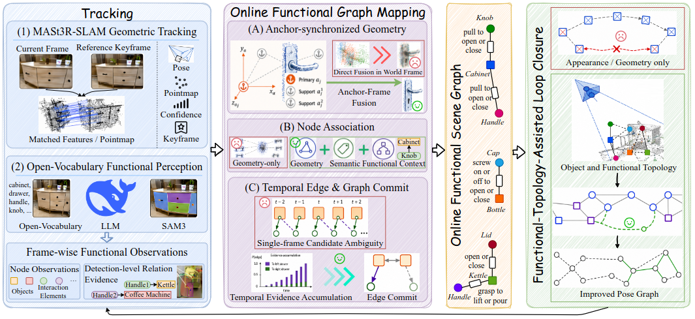

# Functional-SLAM: Interaction-Aware Mapping with Online Functional Scene Graphs (Accepted at CoRL 2026)

Functional-SLAM is an interaction-aware SLAM framework that continuously builds and maintains a functional 3D scene graph during online exploration. In addition to estimating camera motion and scene geometry, it represents objects, robot-operable interaction elements, and the functional relations between them.

## Motivation

Geometric, semantic, and object-level SLAM systems provide increasingly rich scene representations, but they generally do not model the small interaction elements and functional relations required for fine-grained robotic interaction. Recognizing a kettle, for example, is insufficient for reasoning about which handle should be grasped to lift or pour it.

Existing functional 3D scene-graph methods address this limitation but typically rely on known poses, depth input, or offline reconstruction. This makes them difficult to use during real-time exploration. Moving functional graph construction online introduces two central challenges: node geometry must remain consistent while SLAM poses are repeatedly optimized, and ambiguous single-frame functional relations must be stabilized across time.

Functional-SLAM addresses these challenges by maintaining functional nodes in anchor-keyframe coordinates and stabilizing their associations and relations with geometric, semantic, functional-context, and multi-frame evidence. The resulting online graph also supplies functional-topological candidates for loop closure, allowing functional mapping and pose estimation to reinforce one another during exploration.

## Pipeline

  

The pipeline contains three coupled stages:

1. **Tracking and functional perception.** MASt3R-SLAM provides camera poses, pointmaps, confidence estimates, and keyframe decisions. In parallel, open-vocabulary perception, language-model reasoning, and SAM3 produce frame-wise observations of objects, interaction elements, and candidate functional relations.
2. **Online functional graph mapping.** Functional nodes are maintained in anchor-keyframe coordinates so that their geometry remains synchronized with back-end pose optimization. Geometry, semantics, and functional context are combined for persistent node association, while temporal evidence is accumulated before committing stable functional edges.
3. **Functional-topology-assisted loop closure.** Stable object and functional topology supplements appearance-based loop retrieval in scenes with repetitive appearance, degraded texture, or large viewpoint changes. The resulting candidates are geometrically verified and used to improve the pose graph.

Together, these components recursively update an online functional scene graph while preserving the geometric consistency required by SLAM.

## Video

  

  <strong><a href="https://www.bilibili.com/video/BV13xbw6NECB/?vd_source=6546448e43097ee53c80bf0d555403f7">▶ Watch the Functional-SLAM demo on Bilibili</a></strong>

## Code

> [!NOTE]
> Code is coming soon. Please stay tuned.
